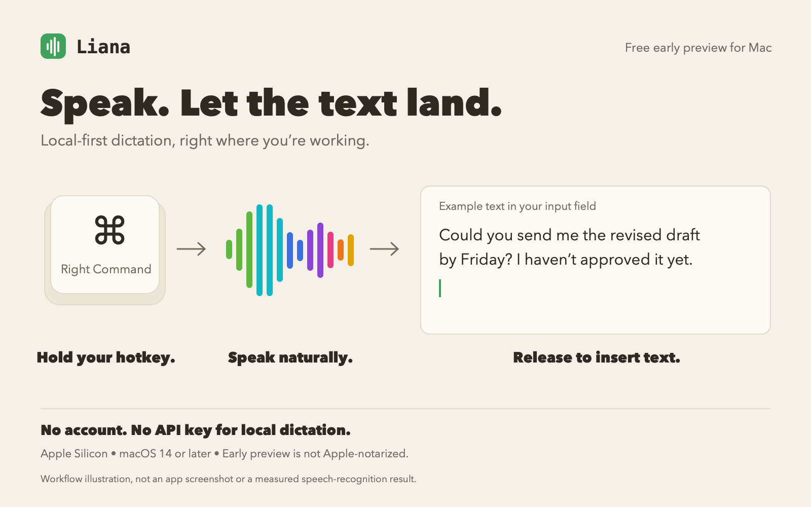
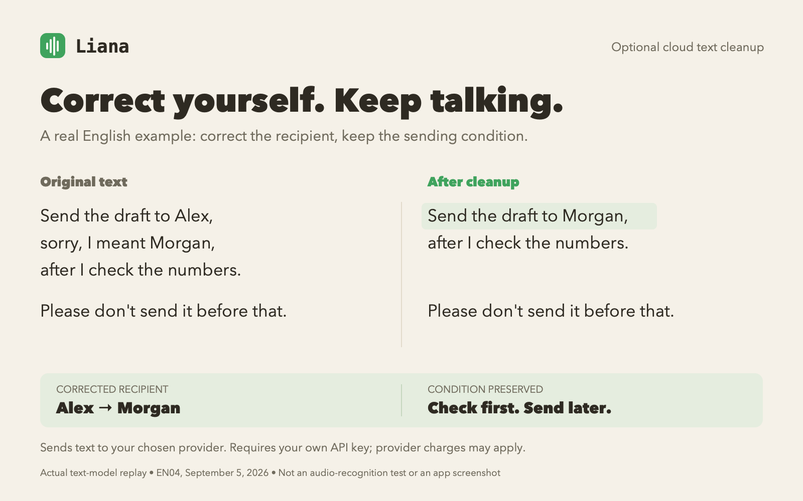
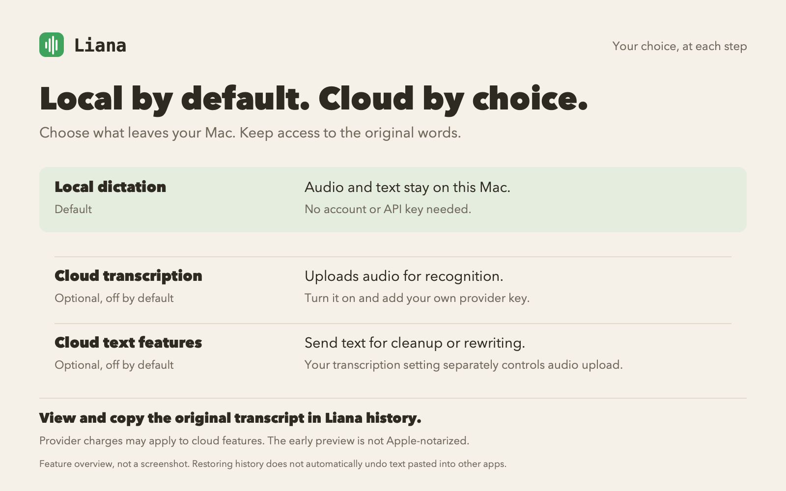

# Liana — speak where you work

Local-first dictation for your Mac. Hold a hotkey, speak, and release to insert text where you're already writing.

[Download the free early preview](https://github.com/Jameswzj-T/liana-releases/releases/tag/v0.1.0-rc.3) · [Quick start](#quick-start) · [中文简介](#中文简介) · [Feedback](https://github.com/Jameswzj-T/liana-releases/issues)

**Apple Silicon · macOS 14 or later · v0.1.0-rc.3 · About 1.08 GB download**

> This preview is ad-hoc signed, but has **no Apple Developer ID signature and is not Apple-notarized**. macOS may block the first launch. Read the installation steps before opening it. All included features are available in this free preview; optional cloud services require your own API key and may charge you separately.



The illustration uses a custom Right Command shortcut. The new-install default is **Command + Shift + D**; you can change it in Settings.

## Speak into your everyday work

- **Messages, notes, and drafts:** dictate into most macOS text fields using a global hotkey.
- **Local by default:** the speech model is bundled. Local dictation needs no account, API key, separate model download, or Python installation.
- **Your words, your spellings:** keep preferred names and explicit transcription corrections in a personal vocabulary. View and copy the original transcript in Liana history.
- **Optional text cleanup:** remove fillers, uninformative repetition, and clearly withdrawn wording. For translation, concision, business tone, or restructuring, select text and approve a preview before replacement.

English, Chinese, and mixed-language speech are supported. Names, accents, and conversational speech can still need correction; this is an early preview, not a claim of perfect recognition.

## Correct yourself. Keep talking.

In this actual English text-cleanup result, the speaker changes the recipient from Alex to Morgan. The corrected name is kept, along with the requirement to check the numbers before sending.



This is a real text-model response to a prepared example, not a microphone recognition test or an app screenshot. The result is shown without manual wording changes. Text cleanup is optional and cloud-based; it can be used while speech recognition stays local. Liana edits the words here—it does not send the draft for you.

## Local by default. Cloud by choice.



| Feature | New-install default | What goes to a cloud provider |
| --- | --- | --- |
| Local dictation | On | Nothing |
| High-accuracy cloud transcription | Off | The current recording and spelling hints |
| Automatic text cleanup | Off | The current transcript, without audio |
| Selected-text rewriting | Off | The selected text and your instruction text, without audio |

Cloud features require opt-in and your own provider key. Saving a key does not turn them on. Keys stay in macOS Keychain; provider retention policies and fees apply to requests you enable. [Privacy details](https://github.com/Jameswzj-T/liana-releases/blob/main/PRIVACY.md).

History lets you view and copy the original transcript. It does not automatically undo text already pasted into another app.

## Quick start

1. Download `Liana-0.1.0-rc.3-macos-arm64.zip` and `SHA256SUMS.txt` from the [RC3 release](https://github.com/Jameswzj-T/liana-releases/releases/tag/v0.1.0-rc.3). Verify the ZIP before opening it:

   ```bash
   shasum -a 256 ~/Downloads/Liana-0.1.0-rc.3-macos-arm64.zip
   ```

   Expected SHA-256:

   ```text
   601a40b010388396938d9c45deb79c3a4e18730597144c66d391454ea46c4a39
   ```

   If it differs, do not open the app. Download it again from this repository. A matching hash checks that the file matches this release; it is not an Apple safety certification.

2. Unzip the archive and drag `Liana.app` into Applications. If macOS blocks the first launch, only proceed if you trust this preview and verified its source and hash: try opening it once, then go to **System Settings → Privacy & Security → Open Anyway**. Do not disable Gatekeeper globally. See the [full installation guide](https://github.com/Jameswzj-T/liana-releases/blob/main/INSTALL.md).
3. Allow Microphone and Accessibility permissions when requested. These are needed to record speech, listen for the hotkey, and insert text into the current app. Restart Liana if macOS requests it.
4. Focus a text field. Hold **Command + Shift + D** (or the dictation shortcut shown in your Settings), speak, then release. Start with local dictation; no key is needed. You can set Right Command as your shortcut to match the illustration.

## Before you rely on the preview

- Apple Silicon only; no Intel build and no automatic updater. Get updates from this repository's releases.
- It has not completed broad multi-Mac or long-term user validation. Focus and permission behavior can differ between apps.
- Transcription and AI cleanup can mishear, omit, or change details. Review important names, numbers, and conditions.
- Optional cloud availability, request handling, and costs depend on the provider you choose. Liana itself does not charge for this preview.

## Help shape the next version

Try it in an ordinary task, then [tell us what happened](https://github.com/Jameswzj-T/liana-releases/issues):

- Could you install it and complete your first dictation?
- Which app, language, and local/cloud settings were you using?
- Would you keep using it? What needed correcting?

Include your Mac chip, macOS version, and Liana version when reporting a bug. Share only examples you are comfortable making public. **Do not post API keys, private dictated text, recordings, or unredacted logs.** For security issues, use [private vulnerability reporting](https://github.com/Jameswzj-T/liana-releases/security/advisories/new), not a public issue.

This repository contains downloads, documentation, and feedback—not the development source code. The existing [license](https://github.com/Jameswzj-T/liana-releases/blob/main/LICENSE) and [security guidance](https://github.com/Jameswzj-T/liana-releases/blob/main/SECURITY.md) apply unchanged.

## 中文简介

Liana 是 macOS 本地优先听写工具：按住热键说话，松开后文字落在光标处。新安装的默认热键是 Command + Shift + D，可在设置中改成图片示范的右侧 Command。支持中文、英文和中英混说，默认本地转写，无需账号或 API Key；模型和运行环境随安装包提供。

当前是免费的早期预览版，所有现有功能均可试用，不是已经过苹果 Developer ID 签名和公证的正式版。仅支持 Apple Silicon、macOS 14 及以上，下载约 1.08 GB。请按上方步骤校验文件，再参考[安装说明](https://github.com/Jameswzj-T/liana-releases/blob/main/INSTALL.md)打开。

云端转写上传录音；自动整理上传文字；选中文字改写先预览、确认后替换。这些能力默认关闭，需主动启用并自备 Key，可能产生第三方费用。介绍图是流程与真实文本整理示例，不是录音识别准确率承诺。

欢迎在 [Issues](https://github.com/Jameswzj-T/liana-releases/issues) 反馈安装、日常使用和实际遗漏问题。不要公开私人原文、录音、完整日志或凭据。开发源码目前仍保留在私有仓库。
