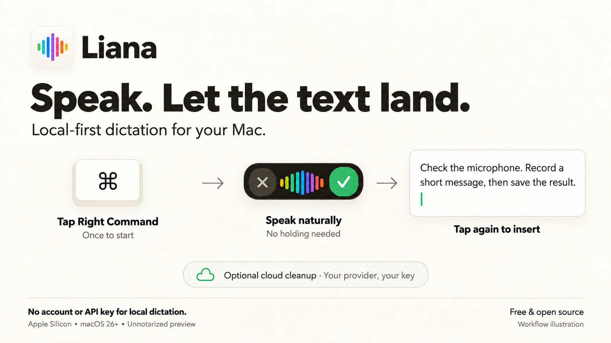
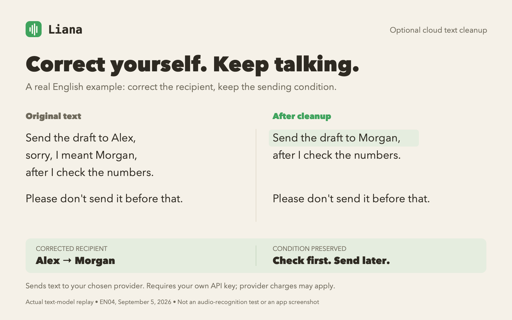
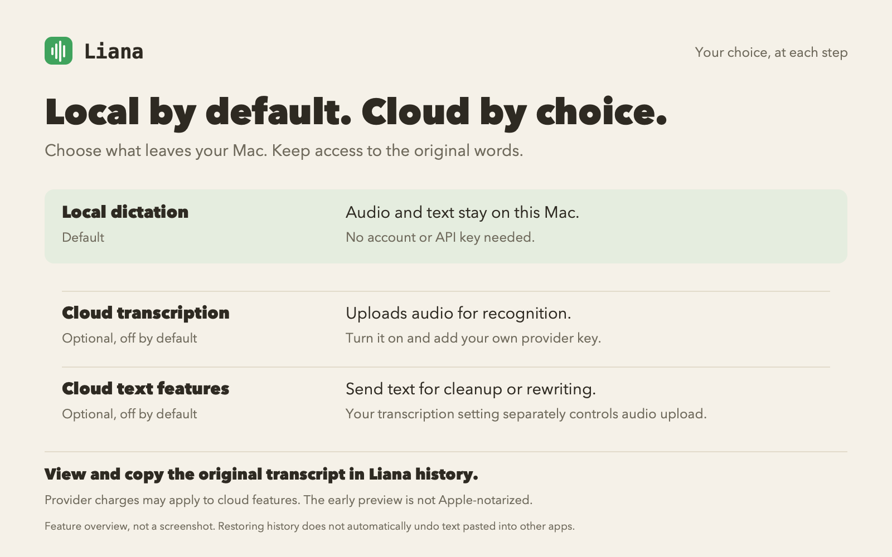

# Liana — speak where you work

Local-first dictation for your Mac. Tap Right Command, speak, and tap again to insert text where you're already writing.

[Download RC5 — free early preview](https://github.com/Jameswzj-T/liana-releases/releases/tag/v0.1.0-rc.5) · [Quick start](#quick-start) · [中文简介](#中文简介) · [Feedback](https://github.com/Jameswzj-T/liana-releases/issues)

**Apple Silicon · macOS 26+ · Open source · Free early preview**

**RC5** includes the app, local speech model, and runtime in one download (about 1.07 GB). The product source is included in this repository under the MIT license. See [what's included and known limitations](releases/v0.1.0-rc.5.md); [RC4](https://github.com/Jameswzj-T/liana-releases/releases/tag/v0.1.0-rc.4) remains available as a previous release.

> This preview is ad-hoc signed, but has **no Apple Developer ID signature and is not Apple-notarized**. macOS may block the first launch. Read the installation steps before opening it. All included features are available in this free preview; optional cloud services require your own API key and may charge you separately.



https://github.com/user-attachments/assets/9330a221-150c-465d-ac24-d872f1cf6475

19-second demo. An edited walkthrough with AI narration, not a real-time speed test. [Download the video](assets/liana-demo-19s.mp4).

New-install shortcuts: **Right Command** for dictation; **Right Option** for the selected-text rewrite panel. Tap, do not hold. Saved custom shortcuts are retained; both shortcuts can be changed in Settings.

## Speak into your everyday work

- **Messages, notes, and drafts:** dictate into most macOS text fields using a global hotkey.
- **Local by default:** the speech model is bundled. Local dictation needs no account, API key, separate model download, or Python installation.
- **Your words, your spellings:** keep preferred names and explicit transcription corrections in a personal vocabulary. View and copy the original transcript in Liana history.
- **Optional text cleanup:** remove fillers, uninformative repetition, and clearly withdrawn wording. For translation, concision, business tone, or restructuring, select text and approve a preview before replacement.

English, Chinese, and mixed-language speech are supported. Names, accents, and conversational speech can still need correction; this is an early preview, not a claim of perfect recognition.

## Correct yourself. Keep talking.

In this actual English text-cleanup result, the speaker changes the recipient from Alex to Morgan. The corrected name is kept, along with the requirement to check the numbers before sending.



This is a real text-model response to a prepared example, not a microphone recognition test or an app screenshot. The result is shown without manual wording changes. Text cleanup is optional and cloud-based; it can be used while speech recognition stays local. Liana edits the words here—it does not send the draft for you.

## Local by default. Cloud by choice.



| Feature | New-install default | What goes to a cloud provider |
| --- | --- | --- |
| Local dictation | On | Nothing |
| High-accuracy cloud transcription | Off | The current recording and spelling hints |
| Automatic text cleanup | Off | The current transcript, without audio |
| Selected-text rewriting | Off | The selected text and your instruction text, without audio |

Cloud features require opt-in and your own provider key. Saving a key does not turn them on. **Save and test / Test service** explicitly sends a fixed test sentence or generated one-second silent clip and may incur a small charge, even if dictation cloud switches remain off. Local Keychain authorization does not itself call a provider. Keys stay in macOS Keychain; provider retention policies and fees apply to requests you enable. [Privacy details](PRIVACY.md).

History lets you view and copy the original transcript. It does not automatically undo text already pasted into another app.

## Quick start

1. Download `Liana-0.1.0-rc.5-macos-arm64.zip` and `SHA256SUMS.txt` from the [RC5 release](https://github.com/Jameswzj-T/liana-releases/releases/tag/v0.1.0-rc.5). Verify the ZIP before opening it:

   ```bash
   shasum -a 256 ~/Downloads/Liana-0.1.0-rc.5-macos-arm64.zip
   ```

   Expected SHA-256:

   ```text
   83eb30a9ea5fce180eb464849600aaf5c08deb427eaf932b0a94a8a9aed8eefe
   ```

   If it differs, do not open the app. Download it again from this repository. A matching hash checks that the file matches this release; it is not an Apple safety certification.

2. Unzip the archive and drag `Liana.app` into Applications. If macOS blocks the first launch, only proceed if you trust this preview and verified its source and hash: try opening it once, then go to **System Settings → Privacy & Security → Open Anyway**. Do not disable Gatekeeper globally. See the [full installation guide](https://github.com/Jameswzj-T/liana-releases/blob/main/INSTALL.md).
3. Allow Microphone and Accessibility permissions when requested. These are needed to record speech, listen for the hotkey, and insert text into the current app. Restart Liana if macOS requests it.
4. Focus a text field. Tap **Right Command** once to start, speak, then tap it again to finish and insert text. Use the shortcut shown in Settings if you already customized it. Local dictation needs no key.
5. For optional selected-text rewriting, enable the text feature and configure your provider key, select text, then tap **Right Option** to open the rewrite panel and speak an instruction. Tap again to finish the instruction; review and approve before replacing text.

## Before you rely on the preview

- Apple Silicon only; no Intel build and no automatic updater. Get updates from this repository's releases.
- It has not completed broad multi-Mac or long-term user validation. Focus and permission behavior can differ between apps.
- Transcription and AI cleanup can mishear, omit, or change details. Review important names, numbers, and conditions.
- Optional cloud availability, request handling, and costs depend on the provider you choose. Liana itself does not charge for this preview.

## Help shape the next version

Try it in an ordinary task, then [tell us what happened](https://github.com/Jameswzj-T/liana-releases/issues):

- Could you install it and complete your first dictation?
- Which app, language, and local/cloud settings were you using?
- Would you keep using it? What needed correcting?

Include your Mac chip, macOS version, and Liana version when reporting a bug. Share only examples you are comfortable making public. **Do not post API keys, private dictated text, recordings, or unredacted logs.** For security issues, use [private vulnerability reporting](https://github.com/Jameswzj-T/liana-releases/security/advisories/new), not a public issue.

## Build from source

This repository now includes the product source, synthetic offline tests, documentation, and the existing preview release history. Private development history, recordings, logs, and account settings are not included.

The supported locked build uses **Apple Silicon, macOS 26+, Python 3.12, and a Swift 6 toolchain**. The app shell's macOS 14 deployment target does not lower the requirement of the bundled MLX runtime. See [building instructions](docs/BUILDING.md), [Chinese source overview](docs/SOURCE_OVERVIEW_ZH.md), [third-party notices](THIRD_PARTY_NOTICES.md), and [release requirements](docs/RELEASING.md).

The existing [MIT license](LICENSE) covers project source; third-party components retain their own licenses. [Security guidance](SECURITY.md) applies unchanged. Source compilation and automated checks are not substitutes for clean-device installation or microphone/permission acceptance.

## 中文简介

Liana 是 macOS 本地优先听写工具：点一下右侧 Command 开始说话，再点一下结束，文字落在光标处，不用一直按住。新安装默认右侧 Option 打开选中文字改写面板；已有自定义快捷键保留，也可在设置中修改。支持中文、英文和中英混说，默认本地转写，无需账号或 API Key；模型和运行环境随安装包提供。

当前 **RC5** 是免费开源的早期预览版，要求 Apple Silicon、macOS 26 及以上，下载约 1.07 GB。产品源码采用 MIT 许可证；[RC4](https://github.com/Jameswzj-T/liana-releases/releases/tag/v0.1.0-rc.4) 保留作历史版本。安装包没有苹果 Developer ID 签名和公证，首次打开可能被系统拦截；请先校验文件，再按[安装说明](INSTALL.md)操作，不要全局关闭系统安全保护。

云端转写上传录音；自动整理上传文字；选中文字改写先预览、确认后替换。这些能力默认关闭，需主动启用并自备 Key，可能产生第三方费用。介绍图是流程与真实文本整理示例，不是录音识别准确率承诺。

欢迎在 [Issues](https://github.com/Jameswzj-T/liana-releases/issues) 反馈安装、日常使用和实际遗漏问题。不要公开私人原文、录音、完整日志或凭据。产品源码已整理到本仓库；私人开发记录、真实口述样本和旧开发历史不公开。
